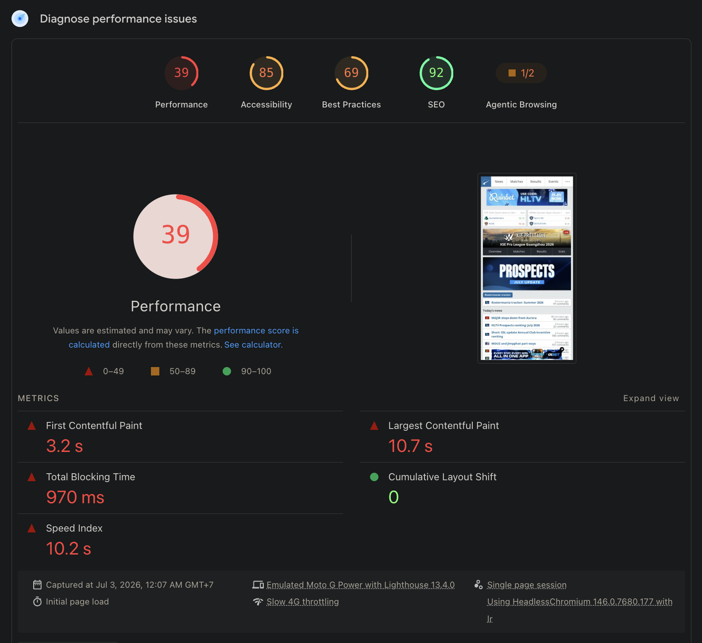
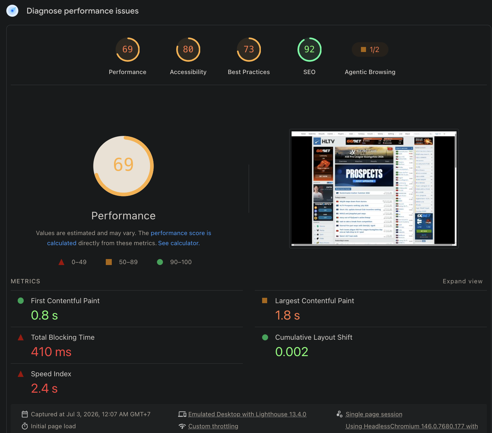

# HLTV — Performance Audit (Personal Project)

Personal project for FE413 Web Performance. This repo tracks my performance
audit of HLTV.org across the course. This first commit is the kickoff: the site,
why I picked it, and the baseline PageSpeed scores.

## The site

HLTV.org — https://www.hltv.org/ — the main news, stats and match-tracking
site for Counter-Strike esports.

## Why it's a good audit candidate

I'm on HLTV most days to check results and read news, so I know it well and care
whether it's fast. It fits the brief:

- It's not a tech company. HLTV is an esports media site, so performance isn't
  its core product — the kind of site that tends to pile up issues.
- It's heavy. Every page carries display and video ads from several networks,
  live-updating match widgets, and large stats tables. On mobile that adds up
  (see the scores below).
- It has a wide mix of content: static article text, real-time match data, big
  stats tables with filters, in-page loaders on the match and results pages, and
  a forum that needs a login to post. That covers every content type the brief
  lists.
- I've never worked on it, so I'm coming in fresh.

## Main PageSpeed Insights scores

Homepage (https://www.hltv.org/), captured 3 July 2026 with Lighthouse 13.4.0.
Mobile is an emulated Moto G Power on Slow 4G; desktop is the emulated desktop
profile.

| Category | Mobile | Desktop |
|----------|:------:|:-------:|
| Performance | 39 | 69 |
| Accessibility | 85 | 80 |
| Best Practices | 69 | 73 |
| SEO | 92 | 92 |

Key mobile lab metrics: LCP 10.7 s, FCP 3.2 s, Total Blocking Time 970 ms,
Speed Index 10.2 s, CLS 0. The red score the brief asks for is the mobile
Performance score of 39.

| Mobile | Desktop |
|:------:|:-------:|
|  |  |

One thing to note early: the lab scores are poor, but the field data (CrUX, real
users) passes Core Web Vitals on both mobile and desktop — mobile LCP 1.8 s,
INP 96 ms, CLS 0. So the throttled lab test and the real-user data disagree,
which is something I want to look into in the full audit. Field-data screenshots
are in `evidence/01-kickoff/` (`homepage-mobile-field.png`,
`homepage-desktop-field.png`).

## Pages the audit will focus on

| Page | URL | Why it's included |
|------|-----|-------------------|
| Homepage | https://www.hltv.org/ | Main entry point; live match ticker, news feed, and the heaviest ad load. The mobile red score is here. |
| Matches | https://www.hltv.org/matches | Live scores that update on the page, filterable by event. Opening a single match gives the busiest page on the site — live scoreboard, embedded streams, betting odds, comments — which I'll sample from here. |
| Results | https://www.hltv.org/results | Paginated, filterable match history — tests large lists, pagination, and filter loaders. |
| Player stats | https://www.hltv.org/stats/players | Large data tables with many filters and query parameters; a slow, interaction-heavy page. |
| World ranking | https://www.hltv.org/ranking/teams | Weekly team ranking with a lot of team logos — an image-heavy page people check often. |
| Forums | https://www.hltv.org/forums | User-posted threads; posting and voting need a login, so this is the authentication surface. |
| News | https://www.hltv.org/news | Article pages are the main reading experience: text, images, embeds and comments, inside a heavy ad layout. |

Across these seven I get static content, dynamic/real-time data, interactive
filtering, in-page loaders, and authentication.

## Repo notes

Screenshots and traces are in `evidence/`. As the course covers each topic
(rendering pipeline, metrics, network/caching) I'll add analysis and findings
here.
